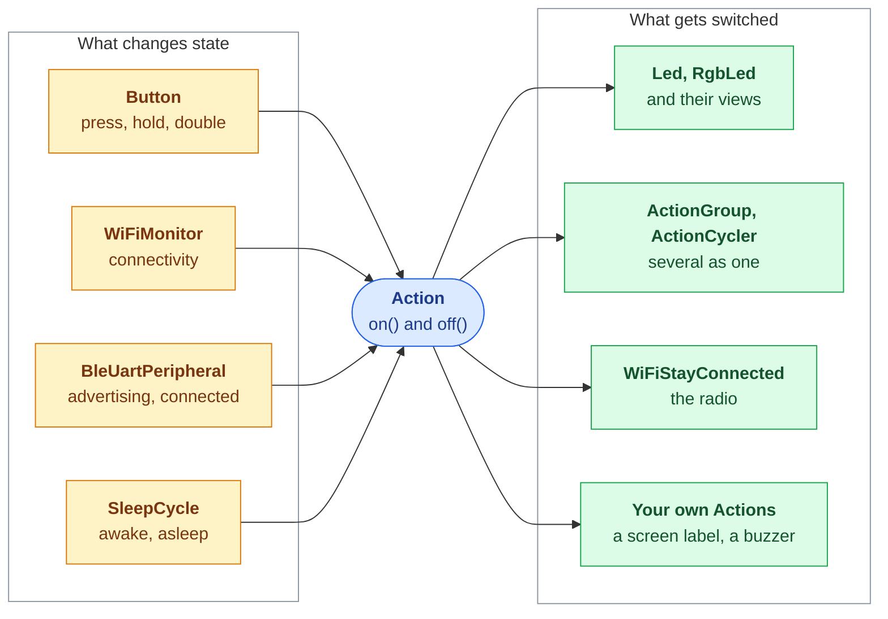

# Corely.MicroPython Documentation

Asyncio building blocks for MicroPython devices. Everything that changes state switches Actions, so LEDs, screens and radios are interchangeable wherever an Action is accepted.

## Concept Map



Amber is what changes state, green is what it switches; the Action contract in blue is all either side knows of the other.

- **Actions**: one `on()` / `off()` contract for anything switchable, with task lifecycles handled
- **Hardware**: LEDs, RGB LEDs and buttons with gestures, all non-blocking
- **Connectivity**: WiFi that stays connected and sets the clock, BLE UART in both roles
- **Sensors**: one sampler owning every sensor, with recovery from a stuck I2C bus
- **Low power**: sleep cycles woken by pin interrupts, latching threshold alarms, deep sleep
- **Unattended running**: rotating logs, watchdog, boot loop detection, over-the-air updates

## Topics
- [Actions](actions.md)
- [LEDs](leds.md)
- [Buttons](buttons.md)
- [WiFi](wifi.md)
- [Bluetooth](bluetooth.md)
- [Sensors](sensors.md)
- [Sleep](sleep.md)
- [Threshold Alarms](threshold-alarms.md)
- [System Health](system-health.md)
- [Logs](logs.md)
- [Over-the-Air Updates](updates.md)

## Quick Start

```bash
mpremote mip install github:ultrabstrong/Corely.MicroPython@Corely.MicroPython-v1.0.0
```

```python
import asyncio
from corely.action import ActionCycler
from corely.button import Button
from corely.led import Led

async def main():
    modes = ActionCycler([Led(16), Led(17, blink_interval_ms=250), Led(18).pulsing(2000)])
    modes.on()
    await Button(0, on_press=modes.move_next).run()

asyncio.run(main())
```

## Modules

| Module | Holds |
|--------|-------|
| `action` | `Action`, `TaskAction`, `ActionCycler`, `ActionGroup` |
| `led`, `rgb_led` | `Led`, `RgbLed` and the colour palette |
| `button` | `Button` |
| `message` | `PrintMessage` |
| `wifi` | `WiFiConnection`, `WiFiStayConnected`, `WiFiMonitor`, `sync_clock()` |
| `ble_uart`, `ble_peripheral`, `ble_central` | Nordic UART Service in both roles |
| `sensors` | `Sensor`, `Bme280`, `Tsl2591`, `Sgp40`, `SensorSampler`, `recover_i2c()` |
| `sleep`, `alarms` | `SleepCycle`, `PinTrigger`, `ThresholdAlarm` |
| `system`, `logs` | `Watchdog`, `BootGuard`, `SystemMonitor`, deep sleep, `RotatingFileHandler` |
| `update` | `Updater` |

Modules are flat files in one package, imported as `from corely.led import Led`. `corely/__init__.py` re-exports nothing, so a project pays in RAM only for the modules it imports.
