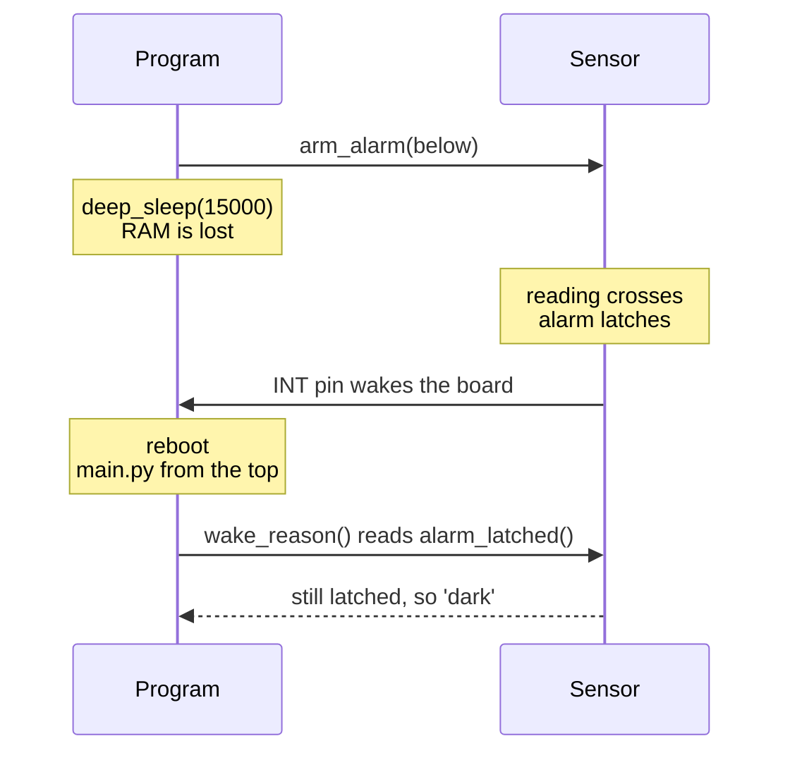

# Sleep

`SleepCycle` runs awake, then asleep until the timer or a trigger, round and round. `deep_sleep()` sleeps through a reboot, and `wake_reason()` works out afterwards what woke it.

## Features
- **Hardware wakes only**: every trigger is a pin interrupt, never a poll
- **Going to sleep is ordinary code**: `sleep_now()` and `keep_awake()` are plain callables
- **False wakes slept through**: only a fired trigger or the timer ends a sleep
- **Toggles**: a trigger can put the board to sleep while awake and wake it while asleep

## Usage

```python
cycle = SleepCycle(awake_ms=5000, asleep_ms=15000,
                   awake_action=ActionGroup(screen_on, green_led),
                   on_wake=lambda reason: print(reason))     # 'timer', 'button', 'dark'
cycle.wake_on("button", PinTrigger(1))
cycle.toggle_on("dark", dark_alarm)
cycle.on()

Button(1, on_press=cycle.keep_awake, on_long_press=cycle.sleep_now)
```

`keep_awake()` restarts the awake timer, which makes an idle timeout out of activity. A trigger already asserted when the cycle goes to sleep (a latched INT, a held button) wakes it at once.

## Deep Sleep

```python
system.deep_sleep(15000, "/reset.txt", wake=[button_trigger, dark_alarm], guard=guard)
# the board reboots; main.py starts again
if last_reset("/reset.txt") == system.DEEP_SLEEP:
    why = system.wake_reason(alarms={'dark': light}, pins={'button': button_trigger})
```



The latch is the only trace of the wake that survives the reboot.

- **Every wake is a reboot.** RAM is gone, so save what must survive first.
- **`wake_reason()` reads what is still true.** A latched sensor alarm names its wake reliably. A button press is usually released by the time the program runs, and reads as `'timer'`.
- **Call it before anything re-arms the alarms**, which clears their latches.
- **Pass the `BootGuard`.** A deep sleep cycle is a string of short boots, which it would otherwise take for a boot loop.

## Notes
- **Turn WiFi off first.** `lightsleep()` returns at once while the radio is on. Bluetooth switched on but idle does not disturb it.
- **`lightsleep()` can return early**, for instance right after a radio switches off, and a pin interrupt's soft handler runs about 1ms after it returns. `SleepCycle` handles both.
- **It refuses to start under a watchdog** whose timeout a sleep would outlast.
- The sleep call is `sleep_fn`, `machine.lightsleep` by default.
- On the RP2, MicroPython's deep sleep is light sleep plus a reboot: the program shape of deep sleep, the power of light sleep. On the ESP32 it is real deep sleep.
