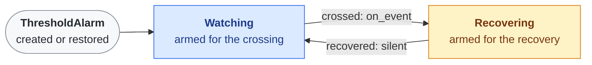

# Threshold Alarms

`ThresholdAlarm` turns a sensor's latching threshold interrupt into one event per crossing. It works as a [sleep](sleep.md) trigger or on its own while awake.

## Features
- **One event per crossing**: arms the crossing, then the recovery, then the crossing again
- **Hysteresis**: the gap between crossing and recovery stops a reading hovering at the line from flapping
- **Thresholds from the reading**: a number, or a function of the current value
- **Bands**: `below` and `above` together; leaving either way is an event
- **Survives a reboot**: `snapshot()` and `restore=` carry it across a deep sleep

## Usage

```python
dark = ThresholdAlarm(light, pin_number=2,
                      below=lambda now: max(120, now // 4),   # or a number
                      recover=lambda threshold: threshold * 2, # or a gap
                      on_event=lambda direction: print(direction))
cycle.toggle_on("dark", dark)       # a SleepCycle trigger
asyncio.create_task(dark.run())     # or on its own while awake
```

## Why the Swap

A button is a doorbell: its signal stops when released. A sensor's threshold interrupt is an alarm clock: it latches until cleared, and latches again at once if the reading is still out of range. Clearing alone loops. The alarm has to be set for the next thing worth hearing, which is the recovery.



Blue is waiting for the event, amber is waiting for the reading to come back. Each latch clears the alarm and arms the other threshold, so one crossing is one event however long the reading stays out of range.

## The Alarm Contract

A sensor joins by implementing five methods, in whatever units its chip compares:

| Method | Meaning |
|--------|---------|
| `alarm_value()` | the reading now, in the threshold's units |
| `arm_alarm(below, above)` | latch when the value leaves the range |
| `clear_alarm()` | release the latch |
| `disarm_alarm()` | switch the alarm off entirely |
| `alarm_latched()` | is it latched now, read from the chip |

`Tsl2591` implements it in raw full spectrum counts.

## Notes
- **TSL2591 thresholds compare counts that include infrared**, while lux subtracts it. A hand over the sensor lets lots of infrared through, so arm relative to the current reading, never at a lux figure.
- Its thresholds take effect only from a fresh measurement, so `set_light_interrupt()` switches the ALS off while writing them. It never uses 0xFFFF, which trips the flags regardless.
