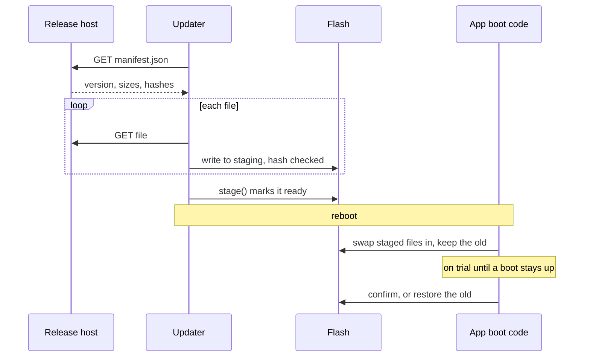

# Over-the-Air Updates

`Updater` fetches a release over WiFi, checks every byte against its manifest, and stages it for the next boot.

## Features
- **Verified**: each file's size and SHA-256 are checked; one mismatch discards the whole download
- **Never half installed**: nothing is ready until `stage()` marks it so
- **Space checked first**: refuses a release that would not fit
- **Non-blocking**: downloads through `aiohttp`, so the event loop keeps running

## Usage

```python
updater = Updater("http://192.168.1.20:8000", current_version)
manifest = await updater.check()          # None if up to date
if manifest:
    await updater.download(manifest)      # UpdateError on any mismatch
    updater.stage(manifest)               # installed on the next boot
```

## Releases

A release is a folder of files laid out as they sit on the device, plus `manifest.json`:

```json
{"version": "1.4.0",
 "files": [{"path": "lib/corely/led.py", "size": 5120, "sha256": "..."}]}
```

Paths outside the filesystem (absolute, or containing `..`) fail the manifest check.

## Installing and Rolling Back



`Updater` stops at staging. Swapping the files in at boot, and rolling back a version that will not stay up, belong to the app, in code its releases never replace: an update must not be able to break its own way back. Install by renaming rather than copying, so a power cut mid install can resume.

## Notes
- **Plain HTTP checks integrity, not origin.** Anyone who can answer for the address can serve a matching manifest. A hosted release needs HTTPS with the certificate checked.
- `UpdateError` covers an unreachable server, a bad manifest, a mismatched file and a full disk.
- `fetch` and `free_bytes` are injectable, for tests or another transport.
