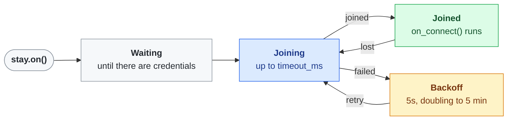

# WiFi

`WiFiConnection` joins one network without blocking the event loop. `WiFiStayConnected` keeps it joined, and `sync_clock()` sets the clock to UTC once it is.

## Features
- **Stays connected**: rejoins after a drop, backing off from 5s to 5 minutes
- **Credentials are the app's**: handed in, changeable at any time with `set_credentials()`
- **Clock in UTC**: over NTP, on each join
- **State as Actions**: `WiFiMonitor` switches an Action per connectivity state

## Usage

```python
wifi = WiFiConnection(ssid, password)
stay = WiFiStayConnected(wifi, on_connect=sync_clock)
stay.on()                                     # joins, rejoins with backoff
wifi.set_credentials(new_ssid, new_password)  # moves it to another network
stay.off()                                    # disconnects, radio off
```

With no credentials it waits for some, so a provisioning flow can hand them over later. New credentials cut a long backoff short.



Blue is trying to join, green is connected, amber is waiting to try again. `stay.off()` leaves any state: it disconnects and switches the radio off.

### Showing the state

```python
monitor = WiFiMonitor(
    wifi,
    connected_action=green_led,
    connecting_action=yellow_led.blinking(500),
    no_internet_action=yellow_led.blinking(500),
    disconnected_action=red_led,
)
asyncio.create_task(monitor.run())
```

Internet access is proven by opening a socket to `8.8.8.8:53`, without blocking.

## Clock

`sync_clock()` sets the clock to UTC with the built-in `ntptime` and returns whether it worked. `clock_is_set()` says whether it has this boot. Until then the board's time of day is meaningless.

## Notes
- **Turn WiFi off before sleeping.** `lightsleep()` returns at once while the radio is on, so a [sleep cycle](sleep.md) would spin awake. `stay.off()` switches the radio off.
- `ntptime` blocks for one round trip (about 110ms on a home network, up to its 1s timeout). Call `sync_clock()` on joining and every few hours, not in a loop.
- `WiFiConnectAction` and `WiFiDisconnectAction` connect and disconnect as Actions, for a button toggling the link.
- Joins and losses are logged once per incident through `logging`, never per retry.
